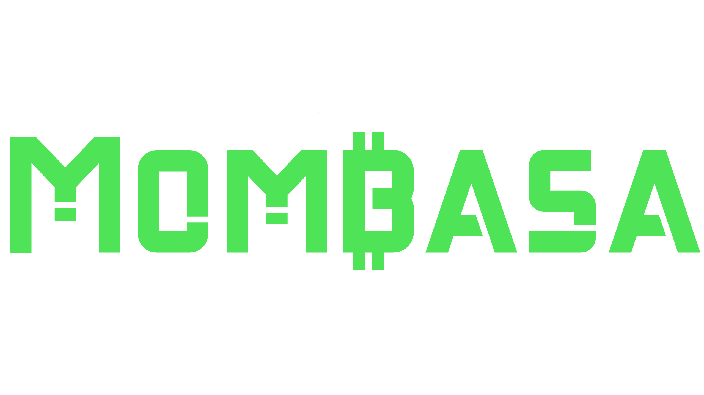

# Mombasa
A Bitcoin Cash (BCH) conversion server, all prices are based in BCH and are showed as if BCH is a dollar (or EUR, MXN, etc.)


## How to run
### **Note: you must be running Mongo and the [Mombasa Ambassador](https://github.com/emilews/mombasa-ambassador) (in that order) before running Mombasa. 
### Manual without building:
Clone this repo and just:
```
go run .
```
### Manual with build:
Clone the repo and do:
```
go build 
```
and run:
```
./mombasa
```
If on linux you can use something like [screen](https://www.gnu.org/software/screen/manual/screen.html) to run it in 
the background.

### Docker image:
You can do it yourself in the root of the repo with:
```
docker build -t mombasa .
```
and run with:
```
docker run -d mombasa
```
### DockerHub image:
Pull the image:
```
docker pull emilews/mombasa
```
and run it in detached mode:
```
docker run -d emilews/mombasa
```
### Doc
### [API Documentation.](API.md)

## More currencies
Please refer to the [Mombasa Papers](https://github.com/emilews/mombasa-ambassador) readme.

## Donations

bitcoincash:qzd2qfp82ppxegg425f3masa5m0qq8mmaqt05h8q8r
